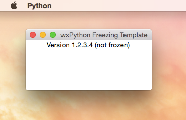

wxPython Freezing Template
==========================

This is a basic template for creating Python applications that use [wxPython](http://wxpython.org).

The Python code of the graphical user interface in ``gui.py`` is generated by [wxFormBuilder](http://sourceforge.net/projects/wxformbuilder/) (3.5.0 beta). The editable project file is ``gui.fbp``. Modify this file with WxFormbuilder and select *File*, *Generate code* afterwards.

Apart from creating new applications I use this template for testing parts of my code that seem problematic when trying to freeze the Python code to an executable with [py2app](http://pythonhosted.org/py2app/), [py2exe](http://www.py2exe.org/), [PyInstaller](http://pythonhosted.org/PyInstaller/) or [cx_freeze](http://cx-freeze.sourceforge.net/).
Using [Nuitka](http://nuitka.net/) is another possibility to get an executable but requires a C++ compiler to be installed on your system. Nuitka is not added here as of now.

The actual OS X \*.app and Windows \*.exe are not included here. The program doesn't do anything. The whole purpose is to create it yourself.
The OS X \.app is about **66MB** in size, its Windows counterpart ranges from **6.9MB** (PyInstaller --onefile with UPX) to **22.1MB** (py2exe).

### Commands

Running the program through the Python interpreter on OS X

    cd ~/Development/wxpython_freezing_template
    /usr/local/Cellar/python/2.7.8_1/bin/python main.py

Running the program through the Python interpreter on Windows

    cd C:\pycharm_projects\wxpython_freezing_template
    C:\Python27\python.exe main.py

Py2app
------

### Links

- [Py2app official page](http://pythonhosted.org//py2app/)
- [Py2app on PyPI](https://pypi.python.org/pypi/py2app)

### Commands

Freezing

    cd ~/Development/wxpython_freezing_template
    /usr/local/Cellar/python/2.7.8_1/bin/python setup_py2applet.py py2app --iconfile=icon.icns

Running the frozen main.app

    cd ~/Development/wxpython_freezing_template
    open ./dist/main.app

Cleaning up

    cd ~/Development/wxpython_freezing_template
    rm -r build
    rm -r dist

Py2exe
------

### Links

- [Py2exe for Python 2.x](http://www.py2exe.org/)
- [Py2exe for Python 3.x](https://pypi.python.org/pypi/py2exe/) (untested)
- [Py2exe list of options for setup.py file](http://py2exe.org/index.cgi/ListOfOptions)
- [Py2exe adding an icon to the exe](http://www.py2exe.org/index.cgi/CustomIcons)

### Commands

Freezing

    cd C:\pycharm_projects\wxpython_freezing_template
    C:\Python27\python.exe setup_py2exe.py py2exe

Running the frozen main.exe

    C:\pycharm_projects\wxpython_freezing_template\dist\main.exe

Cleaning up

    rd C:\pycharm_projects\wxpython_freezing_template\build /s /q
    rd C:\pycharm_projects\wxpython_freezing_template\dist /s /q

PyInstaller
-----------

### Links

- [PyInstaller official page](http://pythonhosted.org/PyInstaller/)
- [PyInstaller Manual - Options](http://pythonhosted.org/PyInstaller/#options)
- [PyInstaller Manual - Spec Files](http://pythonhosted.org/PyInstaller/#using-spec-files)
- [PyInstaller on GitHub](https://github.com/pyinstaller/pyinstaller) (latest version untested)
- [PyInstaller on PyPI](https://pypi.python.org/pypi/PyInstaller/)

### Commands

Creating a very basic specfile for freezing

    cd C:\pycharm_projects\wxpython_freezing_template
    C:\Python27\python.exe C:\Python27\Scripts\pyi-makespec-script.py --windowed --icon=icon.ico --onefile --version-file=setup_pyinstaller_version.txt main.py

Freezing by using a specfile

    cd C:\pycharm_projects\wxpython_freezing_template
    C:\Python27\python.exe C:\Python27\Scripts\pyinstaller-script.py --clean --upx-dir=C:\upx\ setup_pyinstaller_onedir.spec

Running the frozen main.exe

    C:\pycharm_projects\wxpython_freezing_template\dist\main\main.exe

Optional steps for freezing to one \*.exe file afterwards, [directly creating one single \*.exe seems to be not possible](http://stackoverflow.com/questions/13146899/pyinstaller-runtime-error-r6034).

    cd C:\pycharm_projects\wxpython_freezing_template
    xcopy dist\main\main.exe.manifest dist
    xcopy dist\main\icon.ico dist
    xcopy dist\main\logging_to_file.ini dist
    xcopy dist\main\logging_to_terminal.ini dist
    xcopy dist\main\logging_to_terminal_and_file.ini dist
    rd C:\pycharm_projects\wxpython_freezing_template\build /s /q
    rd C:\pycharm_projects\wxpython_freezing_template\dist\main /s /q
    C:\Python27\python.exe  C:\Python27\Scripts\pyinstaller-script.py --clean --upx-dir=C:\upx\ setup_pyinstaller_onefile.spec

Running the frozen one file main.exe

    C:\pycharm_projects\wxpython_freezing_template\dist\main.exe

Cleaning up

    rd C:\pycharm_projects\wxpython_freezing_template\build /s /q
    rd C:\pycharm_projects\wxpython_freezing_template\dist /s /q

cx_Freeze
---------

### Links
- [cx\_Freeze official page](http://cx-freeze.sourceforge.net/)
- [cx\_Freeze distutils setup script](http://cx-freeze.readthedocs.org/en/latest/distutils.html)
- [cx\_Freeze statement on single file executables](http://cx-freeze.readthedocs.org/en/latest/faq.html#single-file-executables)

### Commands

Generating a very basic distutils setup script

    cd C:\pycharm_projects\wxpython_freezing_template
    C:\Python27\python.exe C:\Python27\Scripts\cxfreeze-quickstart.py

Freezing by using a setup script

    cd C:\pycharm_projects\wxpython_freezing_template
    C:\Python27\python.exe setup_cx_freeze.py build

Running the frozen main.exe

    C:\pycharm_projects\wxpython_freezing_template\build\exe.win32-2.7\main.exe

Cleaning up

    rd C:\pycharm_projects\wxpython_freezing_template\build /s /q

Sources
-------

- [wxPython Freezing Template on GitHub](https://github.com/geberl/wxpython_freezing_template)
- [eberl.se](http://www.eberl.se)